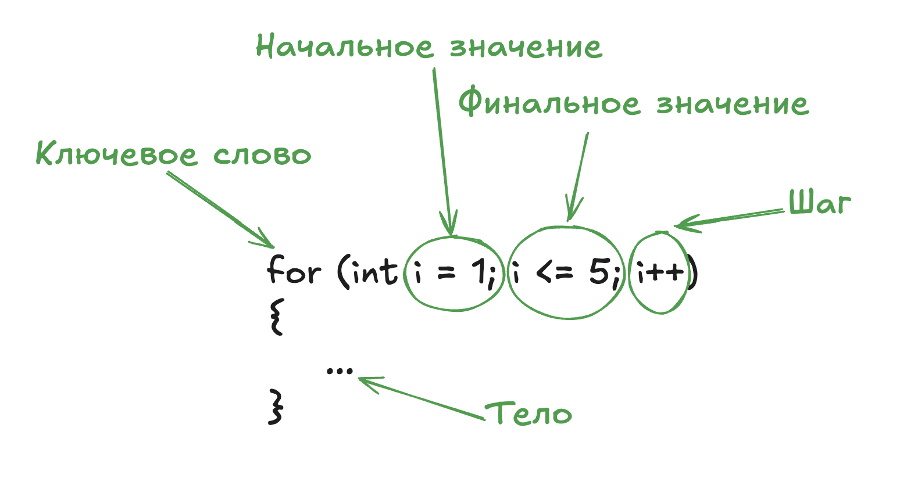

# **Синтаксис: переменные, типы данных, операторы**

**Цель**: Научиться создавать переменные, понимать типы данных и выполнять базовые операции.

## Что такое переменная?

Представьте, что переменная — это коробка с названием, в которой хранится значение. Например:

- `int age = 25;` — коробка с названием `age` хранит число 25.
- `string name = "Анна";` — коробка `name` хранит текст "Анна".

## Типы данных

### Примитивные типы данных

- **Целые числа**: `int` (например, `10`), `long` (для очень больших чисел).
- **Дробные числа**: `float` (например, `3.14f`), `double` (`5.67`).
- **Логический тип**: `bool` (`true` или `false`).
- **Символы и строки**: `char` (один символ, например `'A'`), `string` (текст, например `"Hello"`).

**Пример**:

```csharp
int apples = 5;
double price = 2.99;
bool isAvailable = true;
string message = "Добро пожаловать!";
```

## Операторы

- **Арифметические**: `+`, `-`, `*`, `/`, `%` (остаток от деления).
- **Сравнения**: `==` (равно), `!=` (не равно), `>`, `<`.
- **Логические**: `&&` (И), `||` (ИЛИ), `!` (НЕ).

**Пример**:

```csharp
int x = 10;
int y = 3;
int sum = x + y; // 13
bool isEqual = (x == 10); // true
bool result = (x > 5) && (y < 2); // false
```

---

## Условия и циклы

**Цель**: Научиться управлять потоком выполнения программы.

### Условия: `if-else`

Как выбор между двумя действиями:  
_"Если сегодня дождь, возьми зонт, иначе надень кепку"._

**Пример**:

```csharp
int score = 85;
if (score >= 90)
{
    Console.WriteLine("Отлично!");
}
else if (score >= 70)
{
    Console.WriteLine("Хорошо!"); // Выведется это
}
else
{
    Console.WriteLine("Нужно подтянуть знания.");
}
```

### Циклы

- **`for`**: Когда знаем точное количество повторений.

  

  Пример: _"Вывести числа от 1 до 5"_:

  ```csharp
  for (int i = 1; i <= 5; i++)
  {
      Console.WriteLine(i); // 1, 2, 3, 4, 5
  }
  ```

  Пример: _"Вывести числа с 1 до 10 с шагом 2"_:

  ```csharp
  for (int i = 1; i <= 10; i + 2)
  {
      Console.WriteLine(i); // 1, 3, 5, 7, 9
  }
  ```

  Используя цикл `for` можно реализовать бесконечный цикл. Для этого достаточно не указывать шаг инкремента

  ```csharp
  // Бесконечный цикл
  for (int i = 1; i <= 10;)
  {
      Console.WriteLine(i); // 1, 1, 1, 1, 1 ..
  }
  ```

  Можно указать переменную для цикла вне самого цикла:

  ```csharp
  int i = 1;
  for (; i <= 10; i++)
  {
      Console.WriteLine(i); // 1, 2, 3, 4, 5, 6, 7, 8, 9, 10
  }
  ```

  А можно просто не указывать ни одного параметра в определении цикла `for`, и просто реализовать все условия самостоятельно

  ```csharp
  int i = 1;
  for (; ; )
  {
    if (i > 10)
      break;
    Console.WriteLine(i); // 1, 2, 3, 4, 5, 6, 7, 8, 9, 10
    i += 1;
  }
  ```

- **`foreach`**: Когда нужно пройти по всей коллекции от начала до конца.
  Пример: _"Вывести все, что находится в коллекции чисел"_:

  ```csharp
  var collection = new int[]{1, 2, 3, 4, 5}
  foreach(var item in collection)
  {
    Console.WriteList(item)
  }
  ```

  В отличии от цикла `for` мы не сможем изменить элемент в итерируемой коллекции. Например у нас есть коллекция `List<int>` и при использовании цикла `for` мы можем менять значение элемента в коллекции. [SharpLab](https://sharplab.io/#v2:C4LgTgrgdgPgAgJgIwFgBQcAMACOSAsA3OunAMy4K5IDs6A3uts5Qo2i59gG4CGY2AMYB7ADaiApoOABLYVGwBebFAkB3bABkZAZ2AAeGVGAA+ABQBKbPWxIANNgQOyD/A4CsAX2IcuzAGbCAmZGwNgyStiYhOHY+kJiktJyUAB0AMLC0MAxMgDUeRZMftbFJSwi4lKy8gDaMgC62HnKSD7lniS+fngAnGYAJABEAOT0eJipAFLCRmajDiNDDpVJNVAWnksW7SydaJ5AA===)

  ```csharp
  var collection = new List<int>() { 1, 2, 3, 4, 5};
  for (int i = 0; i < collection.Count; i++)
  {
    collection[i] += 1;
  }

  Console.WriteLine($"'{string.Join("', '", collection)}'"); // '2', '3', '4', '5', '6'
  ```

  Но используя `foreach` так сделать не получится. [SharpLab](https://sharplab.io/#v2:C4LgTgrgdgPgAgJgIwFgBQcAMACOSAsA3OunAMy4K5IDs6A3uts5Qo2i59gG4CGY2AMYB7ADaiApoOABLYVGwBebFAkB3bABkZAZ2AAeGVGAA+ABQBKbPWxIANNgQOyD/A4CsAX2IcuzAGbCYBK8ggAWZnwCMsASALbYRkJiktJyUBZMftZZ2Swx8dgA1MpIPnmeJL5+eACcZgAkAEQA5PR4mAB0AFLCRmatDi1NDiLiUrLyFp7DFuUslWieQA==)

  ```csharp
    var collection = new List<int>() { 1, 2, 3, 4, 5};
    foreach(var item in collection)
    {
        item += 1; // error CS1656: Cannot assign to 'item' because it is a 'foreach iteration variable'
    }

    Console.WriteLine($"'{string.Join("', '", collection)}'");
  ```

- **`while`**: Когда условие повторения неизвестно заранее.  
  Пример: _"Спрашивать пароль, пока не введут верный"_:

  ```csharp
  string correctPassword = "secret";
  string input = "";
  while (input != correctPassword)
  {
      Console.Write("Введите пароль: ");
      input = Console.ReadLine();
  }
  ```

- **`do-while`**: Когда условие повторения неизвестно заранее. Только мы всегда первый раз выполняем действие, а потом уже проверяем условие.
  Пример: _"Считывать строки из стандартного ввода, пока не встретится точка"_:

  ```csharp
  string outputString = "";
  var inputLine = "";
  do
  {
      Console.WriteList("Введите строку. Для выхода введите одну точку '.'")
      inputLine = Console.ReadLine();
      outputString = outputString + inputLine;

  } while(inputLine != ".")
  ```
