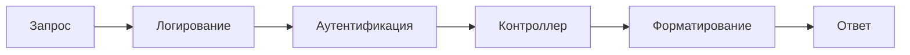

# **Создание API: контроллеры, маршрутизация, Middleware**

**Цель**: Настроить простое API и обрабатывать запросы.

## **Разбор на примере "Онлайн-Библиотеки"**

Представь, что ты создаешь цифровую библиотеку. Твое API — это центральная система, через которую:

- 📚 Пользователи ищут книги
- 📱 Мобильное приложение получает данные
- 🖥️ Администраторы управляют каталогом

## **Контроллеры (Controllers)**

**Аналогия:** Отделы в библиотеке  
Каждый контроллер отвечает за свою предметную область.

**Пример контроллера для книг (`BooksController.cs`):**

```csharp
[ApiController]
[Route("api/books")] // Базовый маршрут
public class BooksController : ControllerBase
{
    private readonly List<Book> _books = new()
    {
        new Book(1, "CLR via C#", "Джеффри Рихтер", 2022),
        new Book(2, "Clean Code", "Роберт Мартин", 2008)
    };

    // GET: api/books
    [HttpGet]
    public IActionResult GetAllBooks()
    {
        return Ok(_books); // 200 OK
    }

    // GET: api/books/2
    [HttpGet("{id}")]
    public IActionResult GetBookById(int id)
    {
        var book = _books.FirstOrDefault(b => b.Id == id);
        return book == null ? NotFound() : Ok(book); // 404 или 200
    }

    // POST: api/books
    [HttpPost]
    public IActionResult AddBook([FromBody] Book newBook)
    {
        newBook.Id = _books.Max(b => b.Id) + 1;
        _books.Add(newBook);
        return CreatedAtAction(nameof(GetBookById), new { id = newBook.Id }, newBook); // 201 Created
    }

    // PUT: api/books/2
    [HttpPut("{id}")]
    public IActionResult UpdateBook(int id, [FromBody] Book updatedBook)
    {
        var book = _books.FirstOrDefault(b => b.Id == id);
        if (book == null) return NotFound();

        book.Title = updatedBook.Title;
        book.Author = updatedBook.Author;
        book.Year = updatedBook.Year;

        return NoContent(); // 204 No Content
    }

    // DELETE: api/books/2
    [HttpDelete("{id}")]
    public IActionResult DeleteBook(int id)
    {
        var book = _books.FirstOrDefault(b => b.Id == id);
        if (book == null) return NotFound();

        _books.Remove(book);
        return NoContent(); // 204
    }
}

public record Book(int Id, string Title, string Author, int Year);
```

**Работа с заголовками:**

```csharp
// Установка кастомного заголовка
Response.Headers.Add("X-Custom-Header", "value");

// Чтение заголовков запроса
var userAgent = Request.Headers["User-Agent"];
```

## **Маршрутизация (Routing)**

**Аналогия:** Система навигации в библиотеке  
Определяет, как запросы попадают в нужный контроллер.

**Принципы:**

1. **Конвенция именования:**

   - URL = `[Базовый_путь]/[Контроллер]/[Метод]`
   - `[Route("api/books")]` → `api/books`

2. **Атрибуты маршрутизации:**

   ```csharp
   [HttpGet("search")] // GET api/books/search?title=clean
   public IActionResult SearchBooks([FromQuery] string title)
   {
       var result = _books.Where(b => b.Title.Contains(title));
       return Ok(result);
   }
   ```

3. **Параметры в пути:**
   - `{id}`, `{name}` → попадают в аргументы метода
   - Типизация: `int id` автоматически конвертирует строку в число

**Параметры маршрутов:**

```csharp
[HttpGet("{id:int:min(1)}")] // Только int > 0
public IActionResult GetById(int id)

[HttpGet("search/{query}")]  // GET api/books/search/csharp
```

---

## **Middleware**

**Аналогия:** Процедуры при входе в библиотеку  
Последовательная обработка запроса до и после контроллера.

**Пример конвейера:**



```csharp
public void Configure(IApplicationBuilder app)
{
    app.UseHttpsRedirection();       // Перенаправление на HTTPS

    app.UseRouting();                // Маршрутизация

    app.UseAuthentication();         // Проверка логина/пароля
    app.UseAuthorization();          // Проверка прав доступа

    app.UseMiddleware<LoggingMiddleware>(); // Кастомный middleware

    app.UseEndpoints(endpoints =>    // Контроллеры
    {
        endpoints.MapControllers();
    });
}
```

**Типичные сценарии:**

1. **Логирование:**

   ```csharp
   app.Use(async (context, next) =>
   {
       Console.WriteLine($"Запрос: {context.Request.Path}");
       await next();
       Console.WriteLine($"Ответ: {context.Response.StatusCode}");
   });
   ```

2. **Обработка ошибок:**

   ```csharp
   app.UseExceptionHandler("/error");
   ```

3. **CORS (Cross-Origin Resource Sharing):**

   ```csharp
   app.UseCors(builder => builder
       .AllowAnyOrigin()
       .AllowAnyMethod()
   );
   ```

4. **Аутентификация:**

   ```csharp
   app.UseAuthentication();
   app.UseAuthorization();
   ```

**Кастомный Middleware (логирование):**

```csharp
public class LoggingMiddleware
{
    private readonly RequestDelegate _next;

    public LoggingMiddleware(RequestDelegate next) => _next = next;

    public async Task Invoke(HttpContext context)
    {
        // До обработки запроса
        Console.WriteLine($"Request: {context.Request.Method} {context.Request.Path}");

        await _next(context); // Передача следующему middleware

        // После обработки
        Console.WriteLine($"Response: {context.Response.StatusCode}");
    }
}
```

---

## **Полный пример: Библиотечный API**

**Запрос:** `GET /api/books/1`

1. **Middleware:**

   - Логирование: "Запрос: /api/books/1"
   - Проверка CORS
   - Аутентификация пользователя

2. **Маршрутизация:**

   - Поиск контроллера: `BooksController`
   - Выбор метода: `GetBookById(int id)`

3. **Контроллер:**

   - Поиск книги с ID=1
   - Формирование ответа

4. **Middleware:**
   - Форматирование в JSON
   - Логирование: "Ответ: 200"

**Ответ:**

```json
{
  "id": 1,
  "title": "CLR via C#",
  "author": "Джеффри Рихтер",
  "year": 2022
}
```

## **Жизненный Цикл HTTP Запроса в ASP.NET Core**

1. Получение TCP-подключения
2. Парсинг HTTP-запроса
3. **Middleware Pipeline:**
   - HTTPS Redirect
   - Static Files
   - Routing
   - Authentication
   - Authorization
4. Выполнение действия контроллера
5. Формирование HTTP-ответа
6. Отправка ответа клиенту

## **Продвинутые практики**

1. **DTO (Data Transfer Objects):**

   ```csharp
   public record BookDto(string Title, string Author, int Year);

   [HttpPost]
   public IActionResult AddBook(BookDto dto)
   {
       var book = new Book(..., dto.Title, dto.Author, dto.Year);
       // ...
   }
   ```

2. **Валидация:**

   ```csharp
   public record BookDto(
       [Required] string Title,
       [StringLength(100)] string Author,
       [Range(1800, 2100)] int Year
   );

   if (!ModelState.IsValid)
       return BadRequest(ModelState);
   ```

3. **Асинхронность:**

   ```csharp
   [HttpGet("{id}")]
   public async Task<IActionResult> GetBookByIdAsync(int id)
   {
       var book = await _dbContext.Books.FindAsync(id);
       // ...
   }
   ```

---

## **Вопросы для проверки**

Реализуйте методы для работы с авторами:

1. `GET /api/authors` – список авторов
2. `GET /api/authors/3/books` – книги автора

**Решение:**

```csharp
[ApiController]
[Route("api/authors")]
public class AuthorsController : ControllerBase
{
    [HttpGet]
    public IActionResult GetAuthors() { ... }

    [HttpGet("{id}/books")]
    public IActionResult GetBooksByAuthor(int id)
    {
        var books = _books.Where(b => b.AuthorId == id);
        return Ok(books);
    }
}
```

---

**Ключевые выводы:**

1. Контроллеры = Отделы бизнес-логики
2. Маршрутизация = Система навигации
3. Middleware = Сквозные процессы

Для запуска API в .NET:

```bash
dotnet new webapi -o LibraryApi
cd LibraryApi
dotnet run
```

Теперь ваше API готово к работе!

Что можно еще улучшить:

- добавить методы для поиска книг по жанру
- добавить систему рейтинга книг
