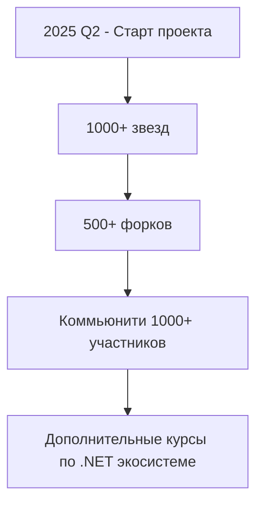

# 🚀 JustLearning DotNET: от основ к профессионализму

**Приветствуем в самом полном и структурированном руководстве по C# на GitHub!**  
Этот репозиторий создан ведущим разработчиком с 7+ годами опыта в построении высоконагруженных распределенных систем, чтобы помочь вам освоить C# от базовых концепций до продвинутых техник.

## 📚 Трехуровневая система обучения

### 1. 🧠 [**C# Essentials**](./0_level-essentials/program.md) - базовый уровень. С самого начала до уровня Junior

- Синтаксис и структуры данных
- ООП: классы, наследование, полиморфизм
- Работа с исключениями
- Основы LINQ и асинхронности
- Практические задания для закрепления

### 2. ⚡ [**C# Advanced**](./1_level-advanced/program.md) - Продвинутые техники. От уровня Junior до уровня Middle

- Углубленное изучение async/await
- Рефлексия и атрибуты
- Оптимизация производительности
- Продвинутые паттерны проектирования
- Работа с потоками и параллелизмом

### 3. ☯︎ [**C# Professional**](./2_level-professional/program.md) - Экспертный уровень. Middle и дальше

- Построение распределенных систем
- Микросервисная архитектура на C#
- Профилирование и оптимизация высоконагруженных систем
- Работа с облачными платформами
- Best practices из реальных проектов

## 🌟 Почему этот репозиторий особенный?

✅ **Практико-ориентированный подход** - минимум теории, максимум реальных примеров  
✅ **Актуальные знания** - материалы регулярно обновляются в соответствии с новыми версиями C#  
✅ **Опыт из production** - техники, проверенные в высоконагруженных системах  
✅ **Полный путь обучения** - от "Hello World" до архитектора распределенных систем  
✅ **Поддержка сообщества** - активный Discord для обсуждения и помощи

## 🛠️ Как использовать репозиторий

1. Клонируйте репозиторий
2. Начните с папки `Essentials` и последовательно проходите материалы
3. Выполняйте практические задания
4. Изучайте примеры кода
5. Присоединяйтесь к сообществу для обсуждения

## 🤝 Присоединяйтесь к сообществу

Мы растем и развиваемся вместе! Ваши:

- ⭐ Звезды репозиторию
- 🐞 Отчеты об ошибках
- 💡 Предложения по улучшению
- 🚀 Пулл-реквесты

помогут сделать этот ресурс еще лучше для всех!

## 📈 Статистика и планы

## 📬 Контакты

Для предложений и сотрудничества:  
✉️ [baldman.gu@gmail.com](mailto:your_email@example.com)  
💬 [Наш Telegram чат](https://t.me/...)

---

**Давайте вместе сделаем C# доступным для всех!**  
⭐ Поставьте звезду, чтобы поддержать проект и не потерять! ⭐

---

_"Лучший способ научиться - это делать. Лучший способ стать профессионалом - это учиться у профессионалов."_
