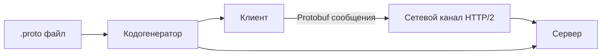
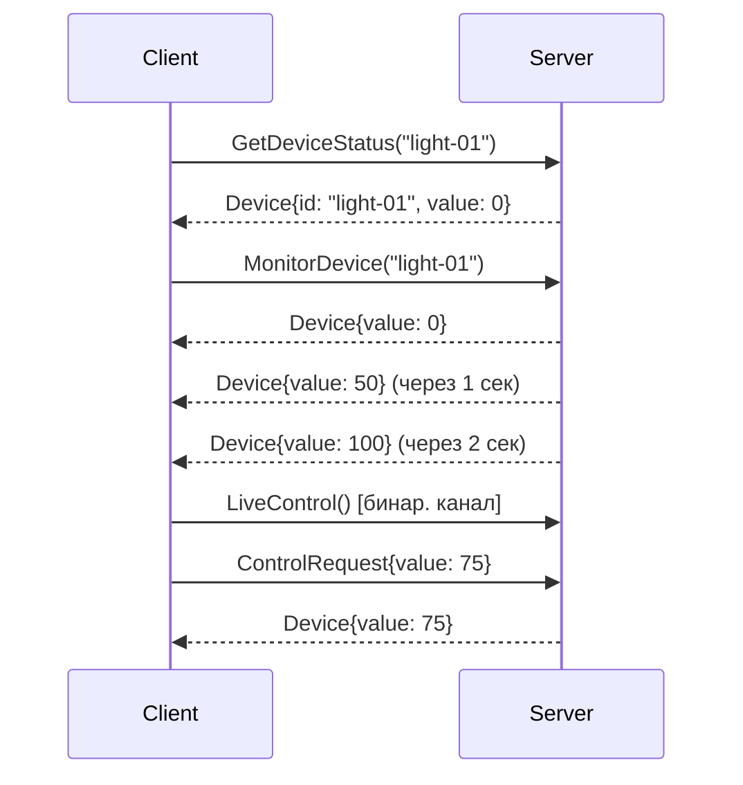

# **Протокол gRPC**

На примере "Системы Умного Дома" — представь, что gRPC это нервная система твоего дома, где устройства быстро обмениваются сообщениями\*\*

---

## **Основы gRPC**

**gRPC (Google Remote Procedure Call)** — современный фреймворк для удаленного вызова процедур (RPC).

**Ключевые особенности:**

- **Бинарный протокол** на основе **HTTP/2**
- Использует **Protocol Buffers (Protobuf)** для описания интерфейсов и сериализации данных
- Поддерживает **4 типа вызовов**:
  1. Унарный (Unary) - один запрос, один ответ
  2. Серверный поток (Server streaming) - один запрос, поток ответов
  3. Клиентский поток (Client streaming) - поток запросов, один ответ
  4. Двунаправленный поток (Bidirectional streaming) - поток запросов и ответов
- **Автогенерация кода** для клиента и сервера
- **Высокая производительность** (в 5-10 раз быстрее REST+JSON)

**Аналогия:**

- Умный дом = Система микросервисов
- gRPC = Проводная связь между устройствами
- Protobuf = Универсальный язык общения

---

## **Архитектура gRPC**



**Компоненты:**

1. **.proto файл** — контракт между клиентом и сервером
2. **Сгенерированный код** — клиентские и серверные классы
3. **Канал (Channel)** — виртуальное соединение между клиентом и сервером
4. **Стуб (Stub)** — клиентский объект для вызовов RPC

---

## **Protocol Buffers (Protobuf)**

**Пример `smart_home.proto`:**

```protobuf
syntax = "proto3";

// Сообщение - данные устройства
message Device {
  string id = 1;
  string name = 2;
  DeviceType type = 3;
  float value = 4;
}

// Типы устройств
enum DeviceType {
  UNKNOWN = 0;
  LIGHT = 1;
  THERMOSTAT = 2;
  CAMERA = 3;
}

// Запрос для управления устройством
message ControlRequest {
  string device_id = 1;
  float target_value = 2;
}

// Ответ сервера
message ControlResponse {
  bool success = 1;
  string message = 2;
}

// Сервис управления умным домом
service SmartHomeService {
  // Унарный RPC
  rpc GetDeviceStatus(DeviceRequest) returns (Device);

  // Серверный поток
  rpc MonitorDevice(DeviceRequest) returns (stream Device);

  // Клиентский поток
  rpc SendMultipleCommands(stream ControlRequest) returns (ControlSummary);

  // Двунаправленный поток
  rpc LiveControl(stream ControlRequest) returns (stream Device);
}

message DeviceRequest {
  string device_id = 1;
}

message ControlSummary {
  int32 success_count = 1;
  int32 failed_count = 2;
}
```

**Особенности Protobuf:**

- **Теги полей (1, 2, 3)** — идентификаторы вместо имен
- **Типы данных:** `string`, `int32`, `float`, `bool`, `enum`, `message`
- **Правила изменения схемы:**
  - Не изменять теги существующих полей
  - Новые поля добавлять с новыми тегами
  - Устаревшие поля помечать `reserved`

---

## **Установка и Генерация Кода в .NET**

**Шаги:**

1. Установите пакеты:

```bash
dotnet add package Grpc.AspNetCore
dotnet add package Google.Protobuf
dotnet add package Grpc.Tools
```

1. Добавьте в `.csproj`:

```xml
<ItemGroup>
  <Protobuf Include="Protos\smart_home.proto" GrpcServices="Server" />
</ItemGroup>
```

1. Сборка проекта автоматически генерирует:

- `SmartHomeService.SmartHomeServiceBase` (сервер)
- `SmartHomeServiceClient` (клиент)

---

## **Реализация Сервера**

**`SmartHomeService.cs`:**

```csharp
using Grpc.Core;
using System.Collections.Concurrent;

public class SmartHomeService : SmartHomeService.SmartHomeServiceBase
{
    private readonly DeviceRepository _repository;

    // Унарный RPC
    public override Task<Device> GetDeviceStatus(DeviceRequest request, ServerCallContext context)
    {
        var device = _repository.GetDevice(request.DeviceId);
        return device == null
            ? throw new RpcException(new Status(StatusCode.NotFound, "Device not found"))
            : Task.FromResult(device);
    }

    // Серверный поток
    public override async Task MonitorDevice(DeviceRequest request,
        IServerStreamWriter<Device> responseStream, ServerCallContext context)
    {
        while (!context.CancellationToken.IsCancellationRequested)
        {
            var device = _repository.GetDevice(request.DeviceId);
            await responseStream.WriteAsync(device);
            await Task.Delay(1000); // Обновление каждую секунду
        }
    }

    // Клиентский поток
    public override async Task<ControlSummary> SendMultipleCommands(
        IAsyncStreamReader<ControlRequest> requestStream,
        ServerCallContext context)
    {
        var summary = new ControlSummary();
        await foreach (var request in requestStream.ReadAllAsync())
        {
            try
            {
                _repository.ControlDevice(request.DeviceId, request.TargetValue);
                summary.SuccessCount++;
            }
            catch
            {
                summary.FailedCount++;
            }
        }
        return summary;
    }

    // Двунаправленный поток
    public override async Task LiveControl(
        IAsyncStreamReader<ControlRequest> requestStream,
        IServerStreamWriter<Device> responseStream,
        ServerCallContext context)
    {
        // Чтение запросов
        var readTask = Task.Run(async () =>
        {
            await foreach (var request in requestStream.ReadAllAsync())
            {
                _repository.ControlDevice(request.DeviceId, request.TargetValue);
            }
        });

        // Отправка состояния
        while (!context.CancellationToken.IsCancellationRequested)
        {
            var devices = _repository.GetAllDevices();
            foreach (var device in devices)
            {
                await responseStream.WriteAsync(device);
            }
            await Task.Delay(2000);
        }

        await readTask;
    }
}
```

**Регистрация сервиса в `Program.cs`:**

```csharp
var builder = WebApplication.CreateBuilder(args);
builder.Services.AddGrpc();
var app = builder.Build();
app.MapGrpcService<SmartHomeService>();
app.Run();
```

---

## **Реализация Клиента**

**`HomeController.cs`:**

```csharp
public class HomeController : Controller
{
    private readonly SmartHomeService.SmartHomeServiceClient _client;

    public HomeController(SmartHomeService.SmartHomeServiceClient client)
    {
        _client = client;
    }

    // Унарный вызов
    public async Task<IActionResult> GetLightStatus(string deviceId)
    {
        var device = await _client.GetDeviceStatusAsync(
            new DeviceRequest { DeviceId = deviceId });
        return View(device);
    }

    // Серверный поток
    public async Task<IActionResult> MonitorThermostat(string deviceId)
    {
        var cts = new CancellationTokenSource(TimeSpan.FromSeconds(30));
        var call = _client.MonitorDevice(
            new DeviceRequest { DeviceId = deviceId },
            cancellationToken: cts.Token);

        var temperatures = new List<float>();
        await foreach (var response in call.ResponseStream.ReadAllAsync())
        {
            temperatures.Add(response.Value);
        }
        return View(temperatures);
    }

    // Клиентский поток
    public async Task<IActionResult> SendCommands(List<ControlRequest> commands)
    {
        using var call = _client.SendMultipleCommands();
        foreach (var cmd in commands)
        {
            await call.RequestStream.WriteAsync(cmd);
        }
        await call.RequestStream.CompleteAsync();
        var summary = await call;
        return View(summary);
    }

    // Двунаправленный поток
    public async Task LiveControl()
    {
        using var call = _client.LiveControl();

        // Поток чтения
        var readTask = Task.Run(async () =>
        {
            await foreach (var device in call.ResponseStream.ReadAllAsync())
            {
                Console.WriteLine($"Device {device.Name}: {device.Value}");
            }
        });

        // Поток записи
        var writeTask = Task.Run(async () =>
        {
            while (true)
            {
                var command = await GenerateCommandFromUIAsync();
                await call.RequestStream.WriteAsync(command);
            }
        });

        await Task.WhenAny(readTask, writeTask);
    }
}
```

---

## **Типы RPC в Деталях**

1. **Унарный (Unary RPC)**

   ```mermaid
   sequenceDiagram
   Client->>Server: Запрос (Request)
   Server->>Client: Ответ (Response)
   ```

2. **Серверный поток (Server Streaming RPC)**

   ```mermaid
   sequenceDiagram
   Client->>Server: Запрос (Request)
   Server-->>Client: Ответ 1 (Stream)
   Server-->>Client: Ответ 2 (Stream)
   Server-->>Client: Ответ N (Stream)
   ```

3. **Клиентский поток (Client Streaming RPC)**

   ```mermaid
   sequenceDiagram
   Client->>Server: Запрос 1 (Stream)
   Client->>Server: Запрос 2 (Stream)
   Client->>Server: Запрос N (Stream)
   Server->>Client: Ответ (Response)
   ```

4. **Двунаправленный поток (Bidirectional Streaming RPC)**

   ```mermaid
   sequenceDiagram
   Client->>Server: Запрос 1
   Server-->>Client: Ответ 1
   Client->>Server: Запрос 2
   Server-->>Client: Ответ 2
   ```

---

## **Обработка Ошибок**

**Статусные коды gRPC (аналоги HTTP):**

- `OK` (0)
- `CANCELLED` (1)
- `INVALID_ARGUMENT` (3)
- `NOT_FOUND` (5)
- `PERMISSION_DENIED` (7)
- `UNAUTHENTICATED` (16)
- `INTERNAL` (13)

**Пример обработки:**

```csharp
try
{
    var response = await client.GetDeviceStatusAsync(request);
}
catch (RpcException ex) when (ex.StatusCode == StatusCode.NotFound)
{
    Console.WriteLine("Устройство не найдено");
}
catch (RpcException ex)
{
    Console.WriteLine($"Ошибка gRPC: {ex.Status.Detail}");
}
```

---

## **Метаданные и Deadline**

**Метаданные (аналоги HTTP-заголовков):**

```csharp
// Клиент
var metadata = new Metadata
{
    { "authorization", $"Bearer {token}" },
    { "client-version", "1.0.2" }
};
var call = client.GetDeviceStatusAsync(request, headers: metadata);

// Сервер
var user = context.RequestHeaders.FirstOrDefault(h => h.Key == "user-id")?.Value;
```

**Deadline (таймаут):**

```csharp
// Клиент
using var call = client.MonitorDevice(request,
    deadline: DateTime.UtcNow.AddSeconds(30));

// Сервер
if (context.Deadline < DateTime.UtcNow)
{
    throw new RpcException(new Status(StatusCode.DeadlineExceeded, "Timeout"));
}
```

---

## **Аутентификация и Безопасность**

1. **SSL/TLS**

   ```csharp
   // Сервер
   webBuilder.ConfigureKestrel(options =>
   {
       options.Listen(IPAddress.Any, 5001, listenOptions =>
       {
           listenOptions.Protocols = HttpProtocols.Http2;
           listenOptions.UseHttps("certificate.pfx", "password");
       });
   });

   // Клиент
   var channel = GrpcChannel.ForAddress("https://example.com");
   ```

2. **Token-based аутентификация:**

   ```csharp
   var credentials = CallCredentials.FromInterceptor((context, metadata) =>
   {
       metadata.Add("authorization", $"Bearer {token}");
       return Task.CompletedTask;
   });
   var channel = GrpcChannel.ForAddress(url, new GrpcChannelOptions
   {
       Credentials = ChannelCredentials.Create(new SslCredentials(), credentials)
   });
   ```

---

## **Оптимизация Производительности**

1. **Пул соединений:**

   ```csharp
   var channel = GrpcChannel.ForAddress(url, new GrpcChannelOptions
   {
       HttpHandler = new SocketsHttpHandler
       {
           PooledConnectionIdleTimeout = Timeout.InfiniteTimeSpan,
           KeepAlivePingDelay = TimeSpan.FromSeconds(60),
           KeepAlivePingTimeout = TimeSpan.FromSeconds(30)
       }
   });
   ```

2. **Компрессия:**

   ```protobuf
   service SmartHomeService {
       rpc GetData(DataRequest) returns (DataResponse) {
           option (grpc.gzip) = true; // Включение сжатия
       }
   }
   ```

3. **Балансировка:**
   - Клиентская балансировка через `Grpc.Net.Client.Balancer`
   - Серверная через Envoy/Linkerd

---

## **gRPC vs REST: Когда Что Использовать**

| Критерий               | gRPC                        | REST (HTTP/1.1 + JSON)        |
| ---------------------- | --------------------------- | ----------------------------- |
| **Производительность** | Высокая (бинарный + HTTP/2) | Средняя                       |
| **Потоковая передача** | Встроенная поддержка        | Частичная (SSE, WebSockets)   |
| **Схема данных**       | Строгая (Protobuf)          | Гибкая (JSON)                 |
| **Браузеры**           | Требует gRPC-Web            | Полная поддержка              |
| **Инструменты**        | Автогенерация кода          | Swagger/Postman               |
| **Идеальные сценарии** | Микросервисы, IoT, стриминг | Публичные API, веб-приложения |

---

## **gRPC-Web: gRPC для Браузеров**

**Архитектура:**

```mermaid
[Браузер] -> [gRPC-Web клиент] -> [Прокси] -> [gRPC сервер]
```

**Настройка в ASP.NET Core:**

```csharp
// Startup.cs
services.AddGrpcWeb(o => o.GrpcWebEnabled = true);

app.UseGrpcWeb();
app.MapGrpcService<SmartHomeService>().EnableGrpcWeb();
```

**Клиент в JavaScript:**

```javascript
import { SmartHomeServiceClient } from "./gen/smart_home_grpc_web_pb";
const client = new SmartHomeServiceClient("https://localhost:5001");

const request = new DeviceRequest();
request.setDeviceId("light-01");

client.getDeviceStatus(request, {}, (err, response) => {
  console.log(response.getStatus());
});
```

---

## **Лучшие Практики**

1. **Версионирование сервисов:**

   ```protobuf
   package smart_home.v1;
   service SmartHomeServiceV1 {...}
   ```

2. **Разделение .proto файлов:**
   - `devices.proto`
   - `security.proto`
   - `automation.proto`

3. **Graceful shutdown:**

   ```csharp
   app.UseEndpoints(endpoints =>
   {
       endpoints.MapGrpcService<SmartHomeService>()
           .RequireHost("*:5001")
           .WithGracefulShutdownTimeout(TimeSpan.FromSeconds(10));
   });
   ```

4. **Мониторинг:**
   - Prometheus + Grafana для метрик
   - OpenTelemetry для трассировки

---

## **Реальный Пример: Управление Освещением**

**Сценарий:**

1. Клиент запрашивает состояние света (унарный)
2. Клиент начинает мониторинг изменений (серверный поток)
3. Клиент отправляет команды на изменение (двунаправленный поток)

**Последовательность вызовов:**



---

## **Отладка и Тестирование**

1. **Инструменты:**
   - **BloomRPC** (GUI-клиент для gRPC)
   - **grpcurl** (аналог curl для gRPC):

     ```bash
     grpcurl -plaintext localhost:5000 list
     grpcurl -plaintext -d '{"device_id":"light-01"}' localhost:5000 smart_home.SmartHomeService/GetDeviceStatus
     ```

2. **Юнит-тестирование:**

   ```csharp
   [Test]
   public async Task GetDeviceStatus_ReturnsDevice()
   {
       // Arrange
       var mockRepo = new Mock<IDeviceRepository>();
       mockRepo.Setup(r => r.GetDevice("light-01")).Returns(new Device { Id = "light-01" });
       var service = new SmartHomeService(mockRepo.Object);

       // Act
       var response = await service.GetDeviceStatus(new DeviceRequest { DeviceId = "light-01" }, null);

       // Assert
       Assert.AreEqual("light-01", response.Id);
   }
   ```

3. **Интеграционное тестирование:**

   ```csharp
   [Fact]
   public async Task GetDeviceStatus_IntegrationTest()
   {
       // Arrange
       var factory = new WebApplicationFactory<Startup>();
       var client = factory.CreateClient();

       // Act
       var grpcClient = GrpcClient.Create<SmartHomeService>(client);
       var response = await grpcClient.GetDeviceStatusAsync(new DeviceRequest { DeviceId = "light-01" });

       // Assert
       Assert.NotNull(response);
   }
   ```

---

**Итог:**
gRPC — мощный инструмент для высокопроизводительных систем, где важны:

- Низкие задержки
- Эффективная бинарная сериализация
- Сложные коммуникационные паттерны (стриминг)
- Строгая типизация контрактов

Для .NET разработчиков gRPC предоставляет:

- Первоклассную поддержку в ASP.NET Core
- Интеграцию с современными облачными платформами
- Инструменты для построения отказоустойчивых микросервисных архитектур
